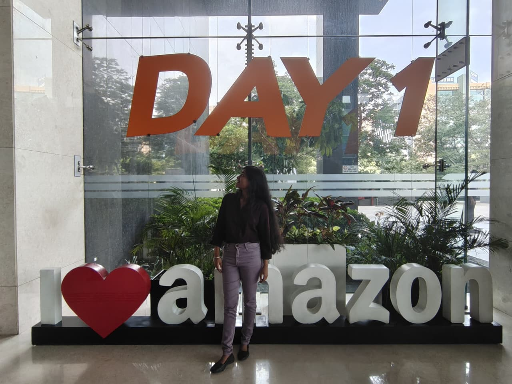
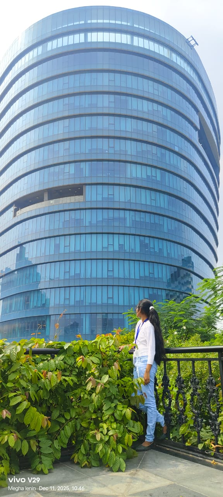

<!-- ============================================================= -->
<!--  MARIA MEGHA L · PROFILE README                              -->
<!--  Theme: Premium Black + Crimson                              -->
<!-- ============================================================= -->

  

  

  

---

## About

I am **Maria Megha L**, a Computer Science and Engineering undergraduate at **Chennai Institute of Technology** (CGPA **8.5/10**), focused on building practical and production-ready software.

I work across full-stack development, AI applications, and cloud-native workflows with strong attention to reliability, performance, and user experience.

### Highlights
- SDE Internship experience at Amazon (data + web workflow engineering)
- DevOps Internship experience at Zoho (monitoring and automation)
- 700+ problems solved on LeetCode with Top 9.72% global standing
- Built and shipped multiple academic and product-focused projects

---

## Skills and Interests

- **Languages:** Python, Java, C++, C, JavaScript, TypeScript, SQL
- **Full-Stack:** React, Next.js, Node.js, FastAPI, Flask
- **Databases:** PostgreSQL, MongoDB, MySQL, SQLite
- **Cloud and Tools:** AWS, Git, GitHub, Postman
- **Focus Areas:** NLP, intelligent automation, backend engineering, system design

---

## Experience

<table width="100%">
<tr>
<td width="26%" align="center" valign="top">

</td>
<td width="74%" valign="top">

**Software Development Engineer Intern - Amazon**  
`May 2026 - Jul 2026 | Chennai, India`

Engineered Java/Scala data services and supported AWS workflow improvements, contributing to higher throughput and stronger internal tooling usability.

`Java` `Scala` `AWS` `Apache Spark` `React`

</td>
</tr>
</table>

 

<table width="100%">
<tr>
<td width="26%" align="center" valign="top">

</td>
<td width="74%" valign="top">

**DevOps Engineer Intern - Zoho Corporation**  
`Nov 2025 - Dec 2025 | Chennai, India`

Built Python executables and optimized Site24x7 agent configurations to improve telemetry quality while reducing system overhead.

`Python` `DevOps` `Site24x7`

</td>
</tr>
</table>

---

## Featured Projects

- [Cloud-Cycle](https://github.com/Mariamegha/Cloud-Cycle): Designed a civic issue reporting flow that improved capture and tracking of cycling infrastructure problems.
- [Urban Noise Mapper](https://github.com/Mariamegha/Urban_Noise_Mapper): Built an AI-enabled spatial analysis pipeline that transforms raw noise data into actionable insights.
- [AI-Driven Prosthetic Hand System](https://github.com/Mariamegha/AI-Driven-Prosthetic-Hand-System): Implemented EMG-based control logic and simulation for faster prototyping and validation.
- [Prepmate AI](https://github.com/Mariamegha/Prepmate_AI): Delivered an interview preparation app with guided practice and AI-assisted feedback loops.

---

## Competitive Programming

- **LeetCode:** Top 9.72% globally, 700+ solved, max rating 1723
- **CodeChef:** 180+ solved, highest rating 1027
- **Codeforces:** 570+ solved with consistent contest participation
- **SkillRack:** 272 solved programs

---

## Connect

 

<a href="#top">Back to top</a>

