<!-- ============================================================= -->
<!--  MARIA MEGHA L · GITHUB PROFILE                              -->
<!--  Theme → "Deep Galaxy" — void black / indigo / violet        -->
<!--  Every visual in assets/ was custom-built for this profile;  -->
<!--  none of it is copied from any other repo.                   -->
<!-- ============================================================= -->

<!--
  THEME CONFIGURATION (see gen_assets.py) — edit the hex values
  there and re-run the script to restyle every asset at once.

  PRIMARY_COLOR      = #05010D  (void black)
  SECONDARY_COLOR    = #1A0B2E  (deep indigo)
  ACCENT_COLOR        = #9D4EDD  (violet)
  ACCENT_COLOR_2      = #C77DFF  (light violet)
  TEXT_COLOR           = #F4EEFF  (starlight white)
  MUTED_TEXT_COLOR    = #A9A1C4  (muted lavender)
-->

 

  

 

---

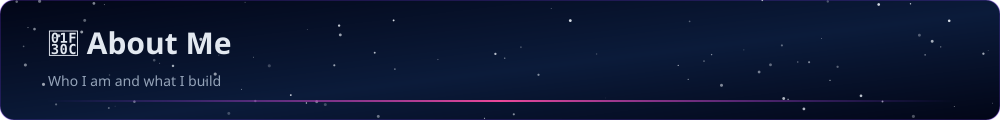

 

I'm **Maria Megha L**, a Computer Science & Engineering undergraduate at **Chennai Institute of Technology** (CGPA **8.6/10**), building agentic AI systems, full-stack platforms, and cloud-native data pipelines.

My work spans **Agentic AI & RAG systems**, **AI-driven statistical processing for government-scale reports**, **forensic intelligence platforms**, and **healthcare automation** — with hands-on internship experience at **Zoho** and **Amazon**.

- 🔭 Currently building AI-powered platforms combining **LLMs, RAG, and multi-agent workflows**
- 🧠 Deep interest in **Agentic AI**, **NLP**, and **intelligent automation**
- 🧩 Actively solving on **LeetCode, CodeChef, Codeforces & SkillRack**
- 🌱 Exploring **cloud-native architectures** on AWS
- 💬 Open to collaborating on **AI, full-stack, and cloud** projects

 

---

## 🧰 Tech Stack

<table width="100%">
<tr>
<td valign="top" width="50%">

**Languages**

**Web Development**

**App Development**

</td>
<td valign="top" width="50%">

**AI & Machine Learning**

`RAG` · `LangGraph` · `Generative AI` · `Agentic AI`

**Backend & Databases**

**System Design & Tools**

`Kafka` · `Redis` · `CDN` · `Microservices` · `HLD & LLD` · `API Design`

</td>
</tr>
</table>

 

---

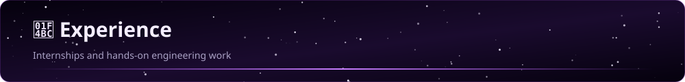

 

<table width="100%">
<tr>
<td width="38%" valign="top">

</td>
<td width="62%" valign="top">

**Software Development Engineer Intern** — Amazon
`May 2026 – July 2026 · Chennai, India`

Engineered Java and Scala-based solutions for large-scale data processing, web scraping, and cloud-native workflows on AWS, leveraging **Apache Spark**, **AWS Step Functions**, and upstream ingestion pipelines. Improved seller recommendation systems, strengthened data validation frameworks, and contributed to React-based internal portals — raising processing efficiency, scalability, and overall user experience.

`Java` `Scala` `AWS` `Apache Spark` `AWS Step Functions` `React`

</td>
</tr>
</table>

 

<table width="100%">
<tr>
<td width="38%" valign="top">

</td>
<td width="62%" valign="top">

**DevOps Engineer Intern** — Zoho Corporation
`Nov 2025 – Dec 2025 · Chennai, India`

Engineered Python-based executables (`.pyz`) and optimized Site24x7 agent configurations to deliver high-fidelity data collection while reducing external customer load. Streamlined system interactions to improve service responsiveness and latency.

`Python` `Site24x7` `DevOps`

</td>
</tr>
</table>

> Drop your own photos into `assets/experience/amazon/amazon-cover.jpg` and `assets/experience/zoho/zoho-cover.jpg` — see `assets/experience/README.md` for the exact filenames expected.

 

---

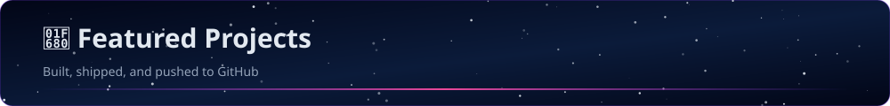

 

<table width="100%">
<tr>
<td width="50%">
<a href="https://github.com/Mariamegha/Cloud-Cycle">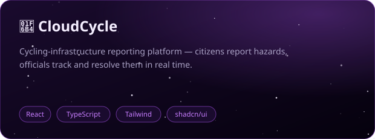</a>
</td>
<td width="50%">
<a href="https://github.com/Mariamegha/Urban_Noise_Mapper">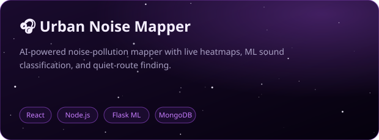</a>
</td>
</tr>
<tr>
<td width="50%">
<a href="https://github.com/Mariamegha/AI-Driven-Prosthetic-Hand-System">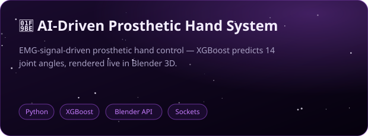</a>
</td>
<td width="50%">
<a href="https://github.com/Mariamegha/Prepmate_AI">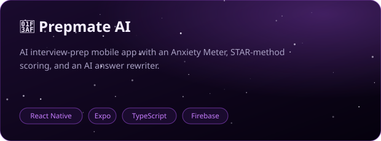</a>
</td>
</tr>
<tr>
<td width="50%">
<a href="https://github.com/Mariamegha">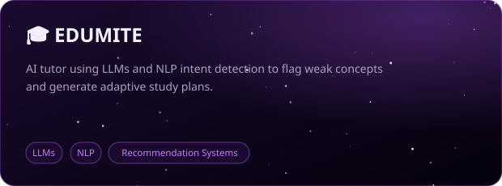</a>
⚠️ Repo link not confirmed yet — currently points to profile. Send me the real URL to swap in.
</td>
<td width="50%" valign="middle" align="center">

</td>
</tr>
</table>

 

---

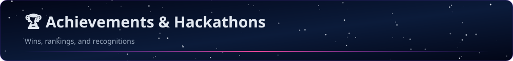

 

 

---

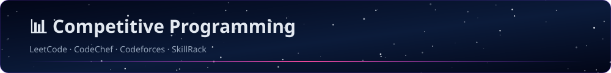

 

| Platform | Handle | Highlights |
|---|---|---|
|  | `Maria_Megha_L` | Top **11.63%** globally · **700+** solved · Max rating **1723** · **200+** active days |
|  | `maria_megha_l` | Div 4 · Country Rank **130874** · **180+** solved · Highest rating **1027** |
|  | `Maria_Megha_L` | Rank **107289** · Bronze **43** · **570+** solved · 2 contest top finishes |
|  | `CS24CIT0495` | Rank **88210** · Bronze **106** · **272** programs solved · 2 contest top finishes |

 

 

---

## 📈 GitHub Analytics

 

 

---

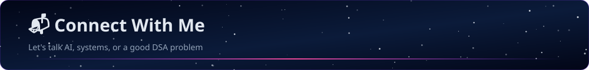

 

  

Thanks for stopping by — always open to a conversation about AI, systems, or a good competitive programming problem.

  

<a href="#top">⬆ Back to top</a>

